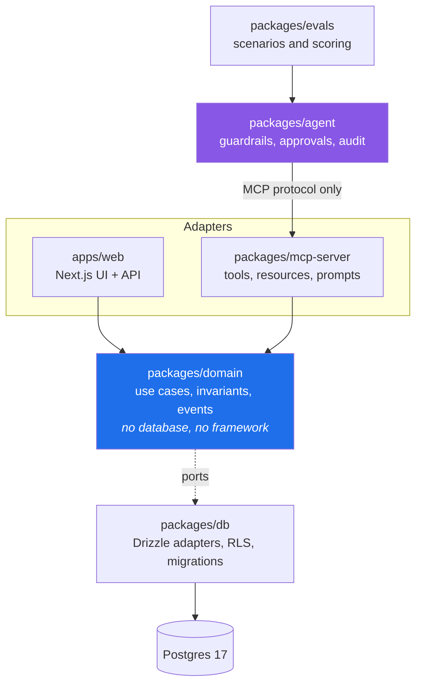

# Ledgerhand

**An ERP is the hard part. Letting an AI agent run it safely is the interesting
part.**

Ledgerhand is a working ERP for a small trading company, an MCP server that
exposes its operations as tools, and an agent that operates the business
through those tools under guardrails that are enforced by the system rather
than requested in a prompt.

The thesis: an agent is only useful in production when it has per-tool
permissions, human confirmation for destructive actions, a complete audit
trail, and a measured success rate. Everything here exists to make those four
things verifiable rather than claimed.

> **Status: phase 1 of 5 complete.** The domain, the database, the migrations,
> the seed and the test suite are done. The web UI, the MCP server, the agent
> and the eval suite are next. This README grows with them.

---

## What works today

| Area                 | State                                                                 |
| -------------------- | --------------------------------------------------------------------- |
| Domain model         | 41 use cases across catalogue, stock, sales, purchasing, finance      |
| Business rules       | Enforced in the domain, not in the UI                                 |
| Postgres + Drizzle   | Schema, migrations, adapters, gap-free fiscal numbering               |
| Tenant isolation     | Row level security, attacked from five directions by tests            |
| Demo data            | 90 days of reproducible trading, generated through the real use cases |
| Tests                | 248 passing, 96% line coverage on the domain, property-based          |
| Web UI               | Phase 2                                                               |
| MCP server           | Phase 3                                                               |
| Agent with approvals | Phase 4                                                               |
| Eval suite           | Phase 5                                                               |

## Quickstart

```bash
pnpm install
docker compose -f docker/compose.yml up -d postgres
cp .env.example .env
pnpm db:migrate
pnpm db:seed
```

That leaves a database with 40 products, 12 customers, 6 suppliers and 90 days
of trading: invoiced orders, receivables both settled and overdue, purchase
receipts, daily cash sessions, and a deliberate replenishment backlog.

Sign in (once the UI lands in phase 2) with `admin@ledgerhand.dev` and the
password from `SEED_PASSWORD`. There is one user per role: `admin`, `sales`,
`finance`, `stock`, `readonly`.

Run everything the CI runs:

```bash
pnpm verify
```

The integration tests need the throwaway database on port 5433:

```bash
docker compose -f docker/compose.yml up -d postgres-test
```

Without it they skip and say so, so `pnpm test` still works on a machine with
no Docker.

## Architecture



The arrow that matters is the one that is missing: `packages/agent` has no
dependency on `packages/db`, and ESLint fails the build if one appears. "The
agent never holds database credentials" is a property of the dependency graph,
not a promise in a document.

## Design decisions

Each of these is written up in [`docs/adr`](docs/adr) with the alternatives
that were rejected and why.

| ADR                                                        | Decision                                                     |
| ---------------------------------------------------------- | ------------------------------------------------------------ |
| [0001](docs/adr/0001-monorepo-and-package-boundaries.md)   | Six packages, one dependency direction, boundaries linted    |
| [0002](docs/adr/0002-use-cases-as-data.md)                 | Use cases described as data; every adapter derives from them |
| [0003](docs/adr/0003-fixed-point-arithmetic.md)            | Scaled `bigint` money and quantities; no floating point      |
| [0004](docs/adr/0004-tenant-isolation.md)                  | Row level security with a non-owner application role         |
| [0005](docs/adr/0005-domain-events-as-audit.md)            | Events committed in the same transaction as the change       |
| [0006](docs/adr/0006-risk-classification-in-the-domain.md) | `read` / `write` / `destructive` decided by the domain       |
| [0007](docs/adr/0007-simulated-fiscal-document.md)         | Simulated NF-e with a real, gap-free numbering seam          |
| [0008](docs/adr/0008-business-dates-and-instants.md)       | A business day is not a timestamp                            |

## Business rules the domain refuses to break

These are enforced in `packages/domain`, so the UI, the HTTP API and the MCP
server all inherit them. Each has a test named after it.

- An order cannot be confirmed without available stock, and a partially
  reservable order reserves nothing at all.
- An order cannot be invoiced unless it is confirmed.
- Cancelling an invoiced order is a reversal: stock returns **at the cost it
  left with**, receivables are cancelled, the fiscal document is voided, and a
  reason is mandatory. It is refused outright if a receivable has already been
  paid.
- A cash day with unsettled titles can be closed only with a justification on
  the record -- blocking it outright would just teach users to post fake
  settlements.
- A closed cash day is frozen: no settlement can be dated into it.
- Stock never goes negative, and a manual write-off cannot strand goods that
  are reserved for a confirmed order.
- Receiving more than was ordered is refused, with the outstanding quantity in
  the message.

## Testing

```
packages/domain   248 tests, 96.6% lines, 93% functions, 86% branches
packages/db       integration tests against Postgres 17
```

Property-based tests (fast-check) cover the parts where a unit test only proves
one example:

- stock never goes negative and never loses track of its balance across
  arbitrary sequences of valid operations;
- the receivables generated by invoicing always sum to exactly the order total,
  for any total and any instalment count;
- weighted average cost stays between the two costs it averages and does not
  drift from an exact computation over long runs of receipts;
- parsing and formatting round-trip at every scale.

Two production bugs were found by these rather than by review: a manual stock
exit could strand a reservation, and the RLS policy raised `22P02` instead of
returning no rows once a pooled connection had been used before.

## Licence

MIT. See [LICENSE](LICENSE).
